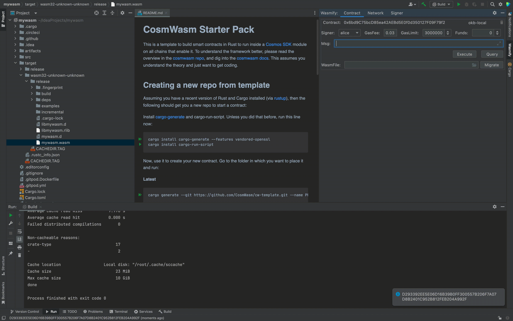

# Wasmify


[](https://plugins.jetbrains.com/plugin/com.github.okayfine996.wasmify)
[](https://plugins.jetbrains.com/plugin/com.github.okayfine996.wasmify)

<!-- Plugin description -->
This Fancy IntelliJ Platform Plugin is going to be your Wasm contract development environment.
With this plugin you can scaffold a template smart contract app development and dramatically simplify the development and deployment process.
<!-- Plugin description end -->

## Installation

- Using IDE built-in plugin system:
  
  <kbd>Settings/Preferences</kbd> > <kbd>Plugins</kbd> > <kbd>Marketplace</kbd> > <kbd>Search for "Wasmify"</kbd> >
  <kbd>Install Plugin</kbd>
  
- Manually:

  Download the [latest release](https://github.com/okayfine996/Wasmify/releases/latest) and install it manually using
  <kbd>Settings/Preferences</kbd> > <kbd>Plugins</kbd> > <kbd>⚙️</kbd> > <kbd>Install plugin from disk...</kbd>

## Initial setup


before creating out wasm project, we need to complete follow steps:
### Install docker

For building and optimizing WASM smart contracts, we recommend to install docker on your personal computer.

we can download docker desktop from [here](https://www.docker.com/), then following official install guideline to install it.

### Setup Rust

While WASM smart contracts can be written in any programming language, **it is strongly recommended that you utilize Rust**, as it is the only language for which mature libraries and tooling exist for CosmWasm. To complete this tutorial, install the latest version of Rust by following the instructions <a href="https://www.rust-lang.org/tools/install" target="_blank">here</a>. Once Rust is installed on your computer, do the following:

1. Set the default release channel used to update Rust to stable.

```sh
rustup default stable
```

2. Add wasm as the compilation target.

```sh
rustup target add wasm32-unknown-unknown
```
## Getting Start
### Create a new project
The cosmwasm module is provided here, just choose to create a project from the contract template.

### Add a signer
We need to create a signer to sign and pay gas fees for transactions, either by entering a private key or a mnemonic.

### Add a network
Add a network on which we deploy contracts and invoke contracts.

if you have no avaliable blockchain network, you can follow [here]('https://github.com/okx/okbchain') to start a blockchain network for yourself.

### Build project
You can click the run botton in the IDEA, then you will get the target file in the target directory.

### Deploy a WasmContract
In the target directory, find the contract file ending with .wasm, then right-click on it alone and select DeployWasm.


### Execute Contract
Open the Wasmify tool window, select the Contracts panel, then type Execute Msg and click the Execute button.


### Query Contract
Open the Wasmify tool window, select the Contracts panel, then type Execute Msg and click the Query button.


### Migrate Contract
To implement support for `MigrateMsg`, add the message to the `msg.rs` file. To do so, navigate to `msg.rs` and place the following code just above the `InstantiateMsg` struct.
```rust
#[cw_serde]
pub struct MigrateMsg {}
```
With `MigrateMsg` defined, update the `contract.rs` file. First, update the import from `crate::msg` to include `MigrateMsg`.

```rust
use crate::msg::{ExecuteMsg, GetCountResponse, InstantiateMsg, QueryMsg, MigrateMsg};
```

Next, add the following method above `instantiate`.

```rust
#[cfg_attr(not(feature = "library"), entry_point)]
pub fn migrate(_deps: DepsMut, _env: Env, _msg: MigrateMsg) -> StdResult<Response> {
    Ok(Response::default())
}
```

Rebuild Contract, click the run button.
Finally, in the Wasmify tool window, select the constructed wasm file, type Msg, and click the Migrate button.


Plugin based on the [IntelliJ Platform Plugin Template][template].

[template]: https://github.com/JetBrains/intellij-platform-plugin-template
[docs:plugin-description]: https://plugins.jetbrains.com/docs/intellij/plugin-user-experience.html#plugin-description-and-presentation